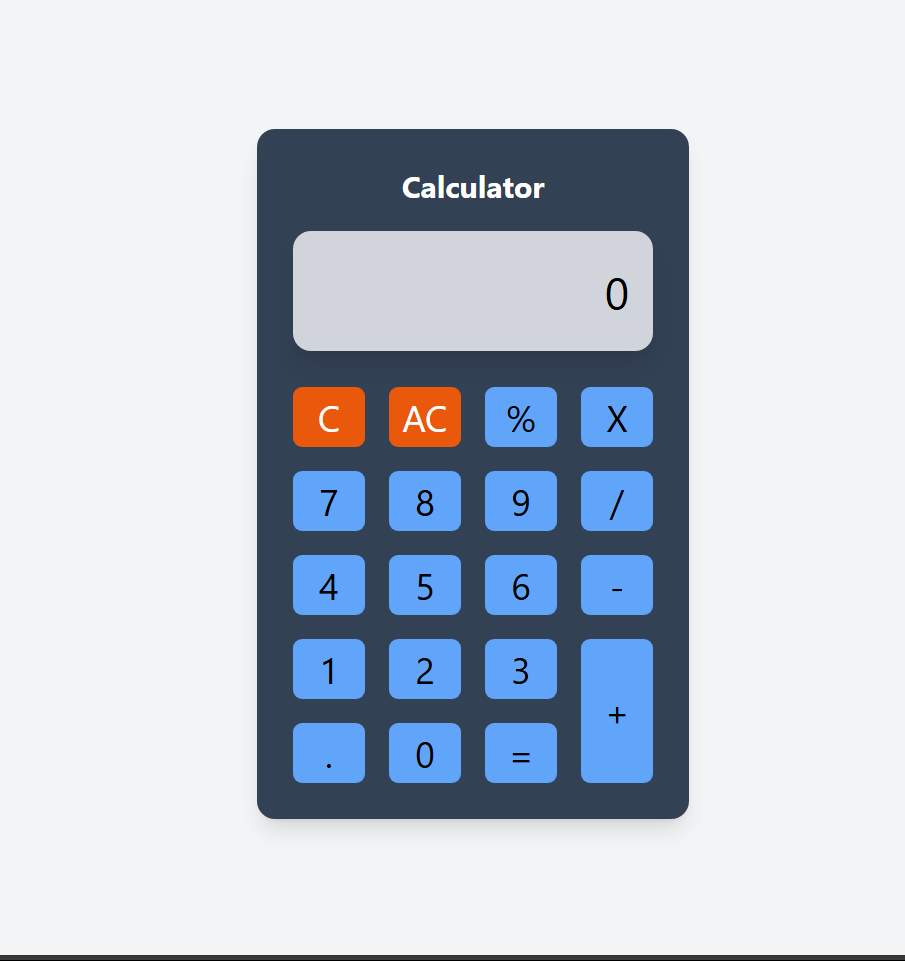

# Simple Web Calculator

A simple and responsive web-based calculator built using HTML, CSS (TailwindCSS), and JavaScript. This calculator supports basic arithmetic operations and has a clean, user-friendly interface.



## Features

- Perform basic arithmetic operations: addition, subtraction, multiplication, division, and modulus.
- Clear (`C`) and All Clear (`AC`) buttons to reset inputs.
- Responsive design using TailwindCSS.
- Keyboard support for input and operations.

## Demo

You can try the calculator live [here](https://your-live-demo-link.com).

## Installation

1. Clone the repository:
   ```bash
   git clone https://github.com/your-username/Web_Calculator.git
   ```
2. Navigate to the project directory:
   ```bash
   cd Web_Calculator
   ```
3. Open `index.html` in your browser to use the calculator.

## Usage

- Click the buttons on the calculator to perform operations.
- Use your keyboard for input:
  - Numbers and `.` for input.
  - `+`, `-`, `*`, `/`, `%` for operations.
  - `Enter` or `=` to calculate the result.
  - `Backspace` to delete the last input.
  - `Escape` to reset the calculator.

## Screenshot


## Technologies Used

- **HTML**: Structure of the web page.
- **CSS (TailwindCSS)**: Styling and layout.
- **JavaScript**: Logic for calculator operations.

## Project Structure

```
Web_Calculator/
├── index.html   # Main HTML file
├── script.js    # JavaScript logic
└── screenshot.png # Screenshot of the calculator
```

## Contributing

Contributions are welcome! Feel free to open an issue or submit a pull request.

## License

This project is licensed under the MIT License. See the [LICENSE](LICENSE) file for details.
